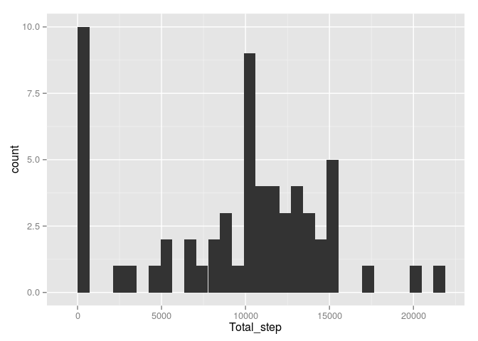
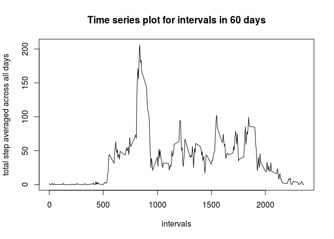
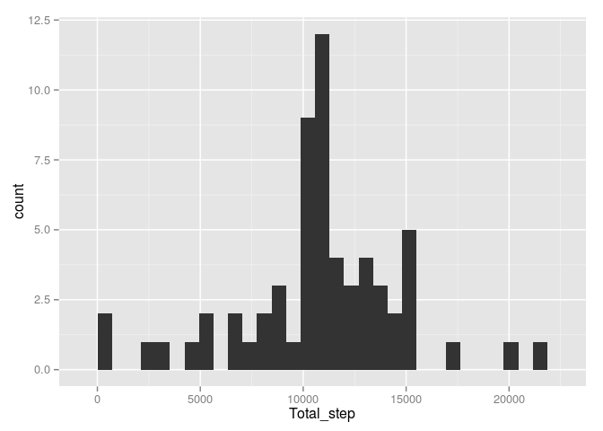
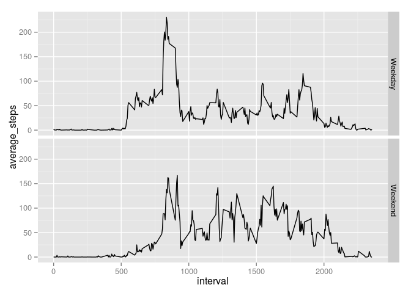

# Reproducible Research: Peer Assessment 1


## Loading and preprocessing the data


```r
library(dplyr)
```

```
## 
## Attaching package: 'dplyr'
## 
## The following objects are masked from 'package:stats':
## 
##     filter, lag
## 
## The following objects are masked from 'package:base':
## 
##     intersect, setdiff, setequal, union
```

```r
library(graphics)
act_file <- read.csv("activity.csv", na.strings = "NA")
act_file$date <- as.Date(as.character(act_file$date), format = "%Y-%m-%d")
```


## 1.What is mean total number of steps taken per day?


### 1.1 The median & mean number of steps per day


```r
act_file_1 <- group_by(act_file, date)
act_summary <- summarize(act_file_1, Total_step = sum(steps, na.rm = TRUE))

cat("The median is ", median(act_summary$Total_step))
```

```
## The median is  10395
```

```r
cat("The mean is ", mean(act_summary$Total_step))
```

```
## The mean is  9354.23
```
  
### 1.2 histogram of daily steps taken 


```r
library(ggplot2)
ggplot(data = act_summary, aes(Total_step)) + geom_histogram()
```

```
## stat_bin: binwidth defaulted to range/30. Use 'binwidth = x' to adjust this.
```

 

## 2. What is the average daily activity pattern?

###2.1. The time series plot

```r
act_file_2 <- group_by(act_file, interval)
act_summary_2 <- summarize(act_file_2, Total_step = mean(steps, na.rm = TRUE))

plot(act_summary_2$interval, act_summary_2$Total_step, type = "l",
     xlab = "intervals", ylab = "total step averaged across all days", 
     main = "Time series plot for intervals in 60 days")
```

 
    
### 2.2. The 5 min interval that contains maximum step is


```r
max_step <- max(act_summary_2$Total_step)
index_step <- grep(max_step, act_summary_2$Total_step)
print(act_summary_2$interval[index_step])
```

```
## [1] 835
```
    
## 3. Imputing missing values

### 3.1. Calculate and report the total number of missing values in the dataset (i.e. the total number of rows with NAs)

```r
check_cases <- complete.cases(act_file)
no_of_missing <- length(check_cases[check_cases == FALSE])
cat("The number of missing values is", no_of_missing)
```

```
## The number of missing values is 2304
```
  
### 3.2. Use mean value of the intervals to fill in any missing values.


```r
act_file_3 <- act_file
for (i in 1:no_of_missing) {
    act_file_3$steps[!check_cases] [i] <- 
        act_summary_2$Total_step[act_summary_2$interval == act_file_3$interval[!check_cases][i]]
    
}
```

### 3.3. Create a new dataset that is equal to the original dataset but with the missing data filled in.

```r
print(head(act_file_3))
```

```
##       steps       date interval
## 1 1.7169811 2012-10-01        0
## 2 0.3396226 2012-10-01        5
## 3 0.1320755 2012-10-01       10
## 4 0.1509434 2012-10-01       15
## 5 0.0754717 2012-10-01       20
## 6 2.0943396 2012-10-01       25
```

### 3.4. Make a histogram of the total number of steps taken each day 

```r
act_file_3 <- group_by(act_file_3, date)
act_summary_3 <- summarize(act_file_3, Total_step = sum(steps))

ggplot(data = act_summary_3, aes(Total_step)) + geom_histogram()
```

```
## stat_bin: binwidth defaulted to range/30. Use 'binwidth = x' to adjust this.
```

 


### 3.5. Calculate and report the mean and median total number of steps taken per day. 


```r
cat("The mean of the total steps of the processed activity data is", mean(act_summary_3$Total_step))
```

```
## The mean of the total steps of the processed activity data is 10766.19
```

```r
cat("The median of the total steps of the processed activity data is", median(act_summary_3$Total_step))
```

```
## The median of the total steps of the processed activity data is 10766.19
```

### 3.6. Do these values differ from the estimates from the first part of the assignment? 

Yes they do. 

For the first part, mean is 9354.23, and for the second part is 10766.19
For the first part, median is 10395, whereas for the second part is 10766.19 as well. 


### 3.7. What is the impact of imputing missing data on the estimates of the total daily number of steps?

As we can see from the two plots above,

1) both mean and median shifted for the distribution of total daily number of steps. 
2) the plot become much more like a bell curve. 

Therefore, the estimates of the total daily number is made to resemble normal distribution. 


## 4. Are there differences in activity patterns between weekdays and weekends?

For this part the weekdays() function may be of some help here. Use the dataset with the filled-in missing values for this part.

### 4.1. Create a new factor variable in the dataset with two levels – “weekday” and “weekend” indicating whether a given date is a weekday or weekend day.
  
[This is where I find the method to create the weekend and weekday variable](http://stackoverflow.com/questions/28893193/creating-factor-variables-weekend-and-weekday-from-date), all credit goes to akrun. 

  

```r
week_day <- c("Monday", "Tuesday", "Wednesday", "Thursday", "Friday")
act_file_3 <- mutate(act_file_3, 
                     day_of_week  = factor(weekdays(date) %in% week_day, 
                                           levels = c(TRUE,FALSE), 
                                           labels = c("Weekday", "Weekend")))
print(head(act_file_3))
```

```
## Source: local data frame [6 x 4]
## Groups: date [1]
## 
##       steps       date interval day_of_week
##       (dbl)     (date)    (int)      (fctr)
## 1 1.7169811 2012-10-01        0     Weekday
## 2 0.3396226 2012-10-01        5     Weekday
## 3 0.1320755 2012-10-01       10     Weekday
## 4 0.1509434 2012-10-01       15     Weekday
## 5 0.0754717 2012-10-01       20     Weekday
## 6 2.0943396 2012-10-01       25     Weekday
```


### 4.2. Make a panel plot containing a time series plot (i.e. type = "l") of the 5-minute interval (x-axis) and the average number of steps taken, averaged across all weekday days or weekend days (y-axis). See the README file in the GitHub repository to see an example of what this plot should look like using simulated data.


```r
act_file_3 <- group_by(act_file_3, interval, day_of_week)
act_summary_4 <- summarise(act_file_3, average_steps = mean(steps))

ggplot(data = act_summary_4, aes(x=interval, y = average_steps)) +geom_line() +
    facet_grid(day_of_week~.)
```

 


  
  
  
